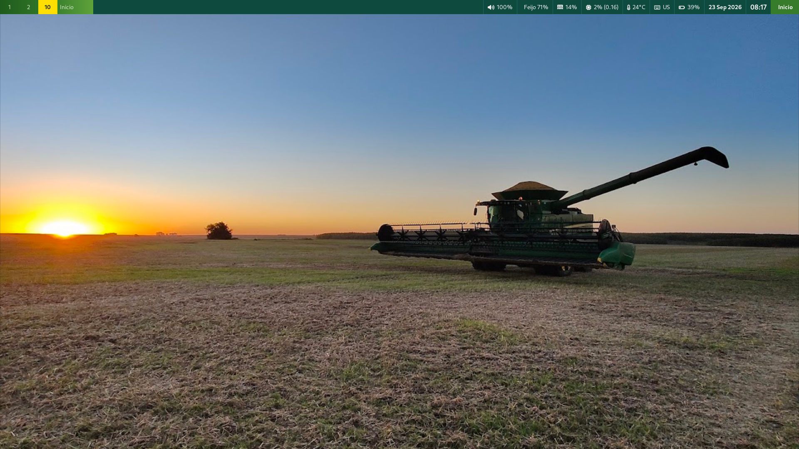
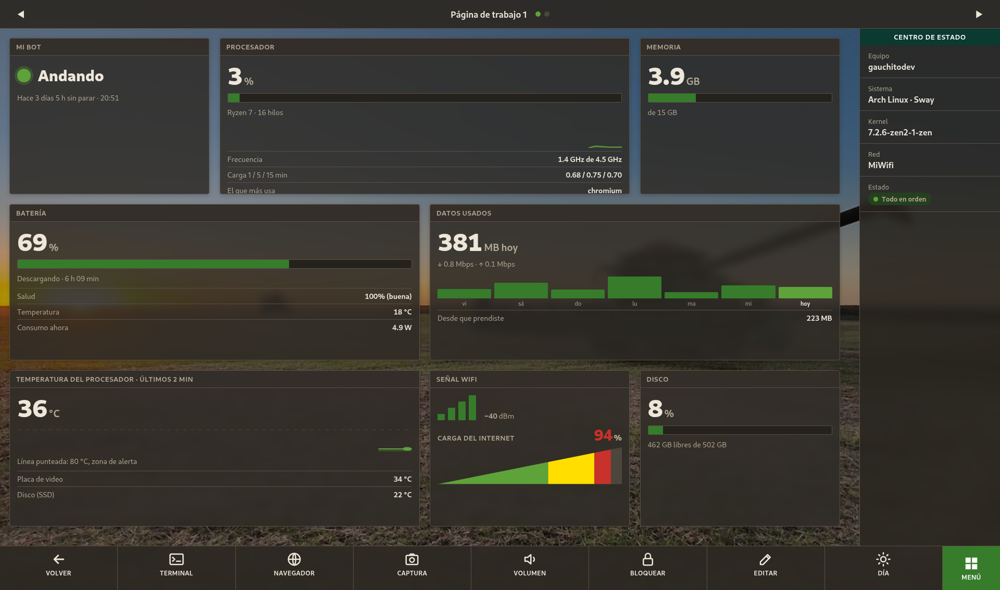
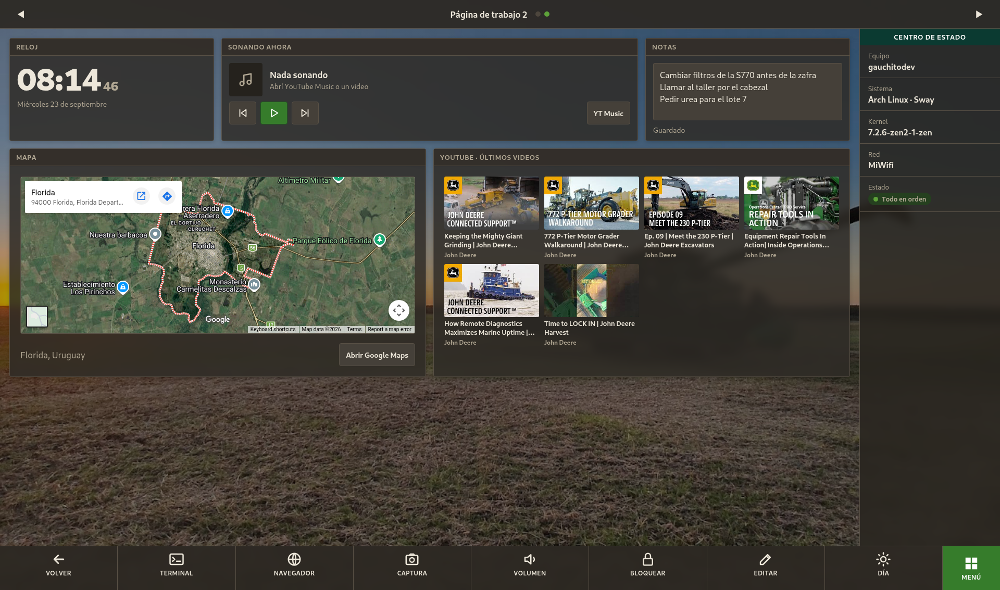
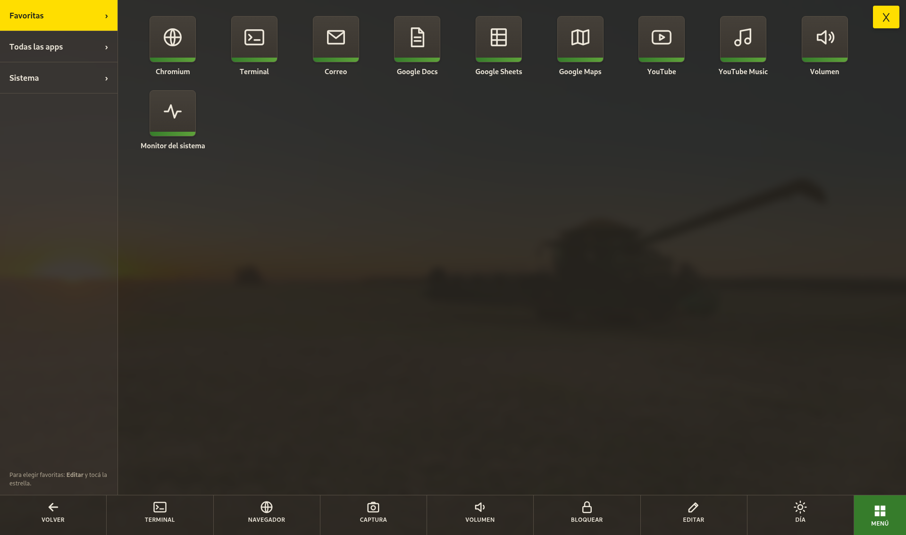
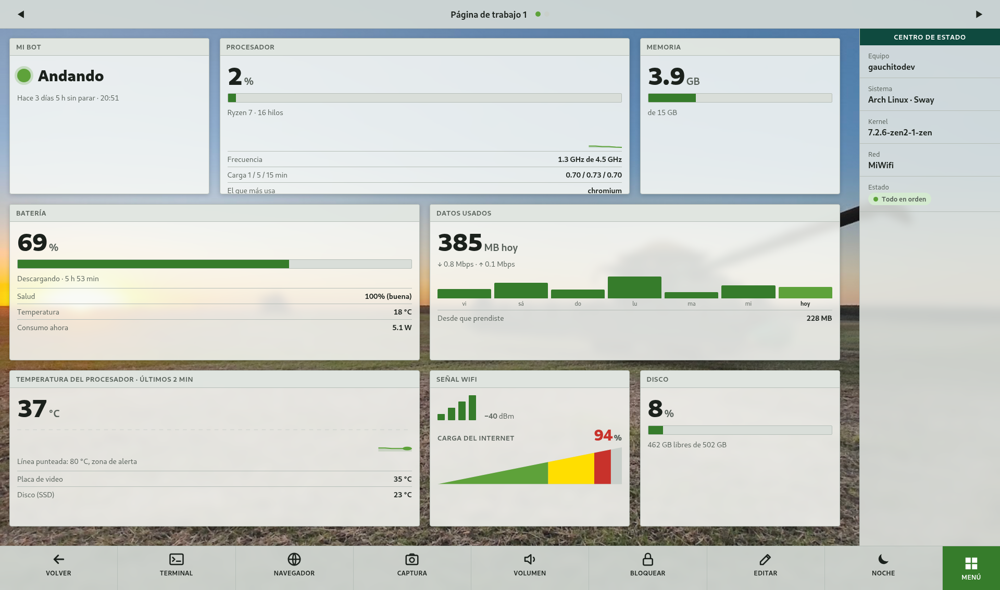
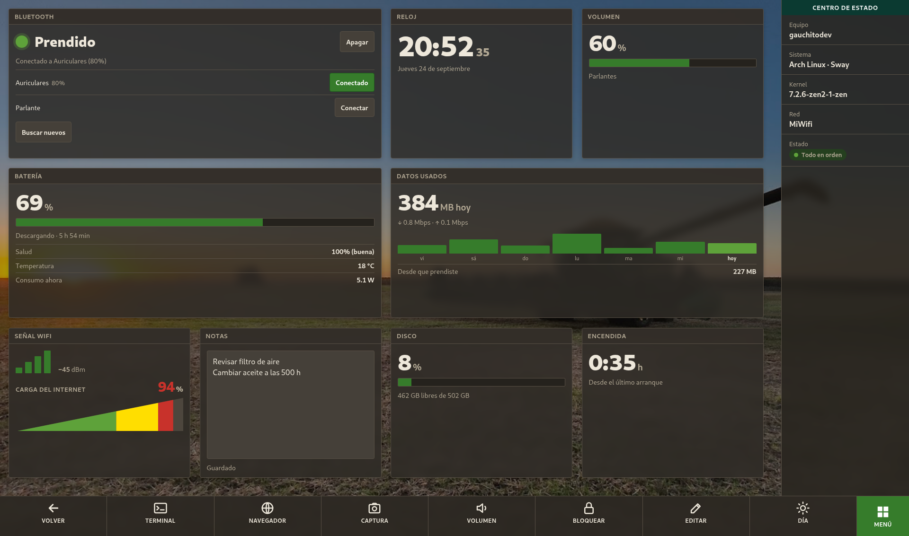
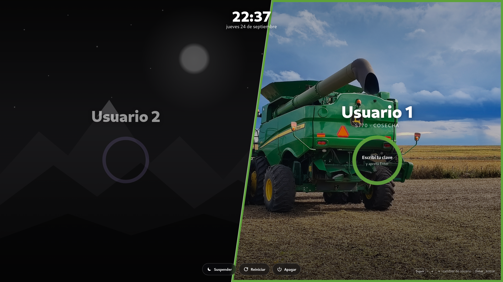

# sway-deere

Escritorio estilo G5 para Sway.

Una capa de personalización para [Sway](https://swaywm.org/) que le da a tu escritorio Linux
la estética de las pantallas de cabina **G5 CommandCenter** de las cosechadoras y tractores:
barra verde, bloque de estado verde azulado, lo seleccionado en amarillo, íconos en
cuadrados con la franjita verde, un medidor de **carga del internet** como la carga del motor
y una **pantalla de inicio táctil** con paneles que movés y agrandás a gusto.

Hecho por un operador de maquinaria agrícola que aprende a programar, para su laptop con
pantalla táctil.





| | |
|---|---|
|  |  |
| Segunda Run Page: reloj, música, notas, mapa y últimos videos | Menú de apps estilo G5 |
|  |  |
| Modo día | Panel de Bluetooth: prender, conectar y vincular con el dedo |


Pantalla de bloqueo (al suspender o con `Super+Shift+X`): la cosechadora de fondo y el círculo en verde G5.



Pantalla de login (opcional) para compus con dos usuarios: cada uno de un lado de la diagonal.

## Qué trae

- **Barra de arriba** (Waybar) con el estilo de la barra de título de la G5:
  - **Carga del internet** al lado del wifi: una rampa que se llena de izquierda a derecha, como la carga
    del motor de la cosechadora (verde, amarilla y roja al tope). El 100 % es la mayor velocidad vista hace
    poco, así se adapta sola a un hotspot o a un wifi rápido. Pasando el mouse muestra bajada, subida y tope.
  - Con un parlante o auriculares **Bluetooth**, el volumen muestra el símbolo y el nombre del aparato.
- **Colores de ventanas, lanzador de apps (wofi), notificaciones (mako) y pantalla de bloqueo** a juego.
- **Apps GTK** (el selector de archivos al descargar o guardar, el control de volumen, etc.) con barra de título
  verde, lo seleccionado en amarillo y el botón de confirmar resaltado.
- **Pantalla de inicio** (`Super+G`), pensada para el dedo:
  - **Run Pages** (como les dice el monitor) con paneles libres: en **Editar** los arrastrás a donde quieras y los agrandás
    desde la esquina amarilla (con el dedo o el mouse), con imán cada 16 px para que queden alineados.
    Mientras editás, la bandeja amarilla ocupa el lugar de la barra de abajo, así la página no se mueve:
    lo que ves es lo que queda.
  - **Deslizar para cambiar de página**: la página sigue al dedo, como en el celular. También con dos dedos
    en el touchpad o con las flechas.
  - Paneles (según el tamaño muestran más o menos detalle):
    batería (salud, temperatura, consumo), procesador, memoria, datos usados por día (para cuidar el hotspot),
    temperaturas, **wifi con la carga del internet** (red, señal, rampa de carga, bajada y subida),
    **Bluetooth** (prender/apagar, conectar tus aparatos, ver su batería y vincular nuevos), disco, reloj,
    **música** (lo que suena en YouTube / YouTube Music, con barra para adelantar, volumen y la portada de fondo),
    mapa, últimos videos de YouTube, notas y el estado de un bot que corre en otro equipo por SSH.
  - **Paneles web** que armás vos: el logo de una app web y botones que abren secciones fijas de ese sitio,
    más (si querés) la lista de los últimos archivos descargados que coinciden con un nombre.
  - **Menú de apps** estilo G5 (las apps web muestran su propio logo): Favoritas, Todas las apps y Sistema (apagar y reiniciar piden dos toques).
  - Modo **día** y **noche** (el cambio se funde suave), y un **bip** al tocar los botones, como el monitor.
- **Calculadora G5** en la tecla de calculadora del teclado (la que está arriba del teclado numérico):
  visor verde azulado, operaciones en amarillo, coma decimal y punto de miles como en Uruguay, las últimas
  cuentas arriba y anda con el teclado numérico. Sigue el modo día o noche de la pantalla de inicio.
  El teclado numérico arranca con Bloq Num prendido.
- Fondo de pantalla y pantalla de bloqueo con fotos propias de una S770 en cosecha.
- **Pantalla de login** opcional (tema para LightDM): dos usuarios a los lados de una diagonal, cada uno con
  su foto y su color. Se elige con el dedo, el mouse o `Super+flechas`, y la clave usa el mismo aro que el
  bloqueo. Suspender, reiniciar y apagar abajo.

## Requisitos

Funciona encima de [sway-workstation](https://github.com/carlosplanchon/sway-workstation)
(de Carlos Planchón): usa su barra y sus atajos como base. La barra G5 carga la config y los estilos
de esa barra y los retoca, y atajos como `Super+D` (lanzador) o `Super+Shift+X` (bloquear) son de ahí.
Sobre otro Sway con Waybar también anda, pero puede que falten módulos en la barra o algunos atajos.

```
sudo pacman -S sway waybar wofi mako swaylock chromium python jq playerctl pamixer brightnessctl grim slurp wl-clipboard foot cantarell-fonts
```

No hace falta instalar nada de Python: el servidor de la pantalla de inicio usa solo la librería estándar.

## Instalación

```
git clone https://github.com/gauchitodev/sway-deere.git ~/.config/g5
~/.config/g5/instalar.sh
```

El instalador:
- agrega **una sola línea** al final de `~/.config/sway/config` (`include ~/.config/g5/sway.conf`),
- enlaza los estilos de wofi, mako y swaylock (si ya tenías uno propio, lo guarda como `.antes-g5`),
- crea la carpeta `local/` con lo que depende de tu usuario.

Se puede correr las veces que quieras.

## Uso

| Qué | Cómo |
|---|---|
| Abrir o cerrar la pantalla de inicio | `Super+G`, o el botón verde **Inicio** de la barra |
| Pasar de página | deslizar el dedo, dos dedos en el touchpad, las flechas de arriba o las del teclado |
| Mover un panel | **Editar** y arrastrarlo |
| Agrandar o achicar un panel | **Editar** y tirar de la esquina amarilla de abajo a la derecha |
| Agregar o quitar paneles | **Editar** → **+ Agregar panel**, o la ✕ roja de cada panel |
| Adelantar un tema | arrastrar la barra del panel de música |
| Menú de apps | botón verde **Menú** (se cierra con la X amarilla o Esc) |
| Calculadora | tecla de calculadora (otra vez la cierra); Ctrl+C copia el resultado |

## Pantalla de login (opcional)

Necesita LightDM con el greeter webkit2:

```
sudo pacman -S lightdm lightdm-webkit2-greeter
```

Para poner tus usuarios, fotos y colores:

```
mkdir -p ~/.config/g5/local/greeter
cp ~/.config/g5/greeter/usuarios.ejemplo.js ~/.config/g5/local/greeter/usuarios.js
```

Editá ese archivo (cambiá `usuario1`/`usuario2` por los nombres de usuario reales) y copiá tus fotos a
la misma carpeta. Después:

```
sudo ~/.config/g5/greeter/instalar.sh
```

Sin `usuarios.js` propio muestra los dos primeros usuarios del sistema: uno con la S770 de la pantalla
de bloqueo y el otro con un dibujo de ejemplo (`greeter/ejemplo/`). Para probarlo sin cerrar sesión,
abrí `greeter/index.html` en Chromium: tiene un modo prueba (la clave es `demo`).
Para volver al login de antes:

```
sudo rm /etc/lightdm/lightdm.conf.d/50-arch-sway-deer.conf && sudo systemctl restart lightdm
```

## Panel del bot (opcional)

Muestra si un bot que corre en otro equipo (por ejemplo, un celular con Termux) está andando.
Se configura en `local/config.json`, que no se sube al repo:

```json
{
  "bot": {
    "nombre": "Mi bot",
    "dispositivo": "el celular",
    "destino": "usuario@192.168.1.50",
    "puerto": 8022,
    "comando": "pgrep -f mi-bot.js >/dev/null || exit 1"
  }
}
```

El `comando` corre en el otro equipo: tiene que salir con `0` si el bot anda (y puede imprimir cuántos
segundos lleva andando) y con `1` si está detenido. Hace falta entrar por SSH **con llave**, sin contraseña.

## Paneles web (opcional)

Cada panel muestra el logo de una app web (un `.desktop` con `Icon=` apuntando a una imagen en
`~/.local/share/icons`) y botones que abren direcciones fijas **con esa misma app**: mismo perfil del
navegador y mismas opciones de su `Exec=`, cambiando solo el `--app=`. Se configuran en `local/config.json`:

```json
{
  "web": [
    {
      "id": "correo",
      "titulo": "Correo",
      "app": "gmail.desktop",
      "enlaces": [
        { "nombre": "Bandeja de entrada", "url": "https://mail.google.com/mail/" },
        { "nombre": "Redactar", "url": "https://mail.google.com/mail/?view=cm" }
      ],
      "archivos": { "titulo": "Últimas descargas", "carpetas": ["~/Downloads"], "patron": "\\.(pdf|zip)$", "dias": 7 }
    }
  ]
}
```

- `id`: solo letras minúsculas (hasta 17). Aparece en **Editar → + Agregar panel** con el `titulo`.
- `enlaces`: hasta 8, solo `https://`. El primero sale resaltado.
- `archivos` (opcional): los últimos 6 archivos de esas carpetas cuyo nombre coincide con `patron`.
  Tocar uno copia su ruta: en la ventana de subir archivos, `Ctrl+L` y pegar.

## Capturas sin datos personales

Para sacar capturas con notas y wifi de mentira, hay un modo demo que corre en otro puerto
y no toca tu configuración:

```
G5_DEMO=1 G5_PUERTO=8790 G5_ESTADO=/tmp/demo.json G5_RED=/tmp/red.json python3 ~/.config/g5/home/server.py
```

y abrí `http://127.0.0.1:8790/` en Chromium.

## Desinstalar

Borrá la línea `include ~/.config/g5/sway.conf` de tu config de Sway, borrá los enlaces
`~/.config/wofi/style.css`, `~/.config/mako/config`, `~/.config/swaylock/config`,
`~/.config/gtk-3.0/gtk.css`, `~/.config/gtk-4.0/gtk.css` (y renombrá los `.antes-g5` si tenías), y recargá con `Super+Shift+C`.

## Un detalle

Hay un **easter egg** escondido. Pista: las fotos tienen historia.

## Licencia y aviso

- Código: licencia MIT, ver [LICENSE](LICENSE).
- Fotos (`fondo.jpg`, `bloqueo.jpg`): © gauchitodev, sacadas en el campo en Uruguay. No están bajo la licencia MIT.
- Proyecto personal inspirado en la estética de las pantallas G5 CommandCenter. **No está afiliado ni
  respaldado por Deere & Company.** John Deere, G5 CommandCenter y el logo del ciervo son marcas de
  Deere & Company. Este repo no incluye software de John Deere.
